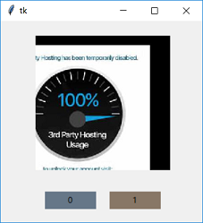
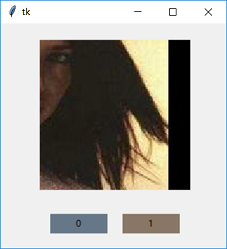
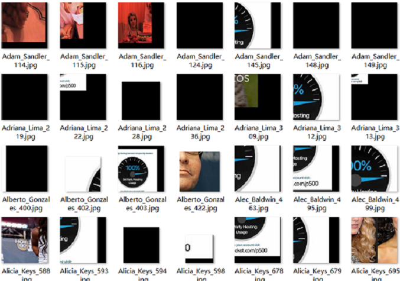

### 人脸筛选

#### 场景

> 昨天在实验室看到师姐使用URL下载人脸数据，但是有些URL已经失效，不能下载到图片，
有的URL可以下载，但是人脸位置的标记有误，所以需要把能用的人脸挑选出来。

* 数据量：10000张以上

* 问题：二分类问题（满足要求的人脸数据，不满足要求的人脸数据）

* 解决方法：手工标注1000张训练和测试数据，使用深度卷积网络进行分类。

#### 数据

> 训练和测试数据使用花两个小时编写的`data/select_image.py` GUI程序来手工标注。

* GUI界面：`0`代表满足要求的图片，`1`代表不满足要求的图片

| 好的数据 | 坏的数据 |
| --- | --- |
|  |  |
|  |  |

* 训练数据和测试数据：`2:1`

#### 模型

> 使用普通的VGG。但是训练过程中发现损失不降。

* 损失不降的原因：待解决的问题是二分类问题，使用`VGG16`或者`VGG19`显得大才小用，
本来损失就小，所以导致梯度快速的消失。所以尽可能在精度达到要求的前提下缩小网络。
    1. 卷积核数量减少为原来的1/2
    2. 卷积层每个模块减少一个
    3. 全连接神经元个数减少为128/64

#### 训练

> 由于问题简单，网络较小，所以训练特别快。

* 最终精度达到`99.25%`

#### 推理

> 推理速度非常快，10000张图片，只需50秒左右，并且结果完全满足要求。

| 好的数据 | 坏的数据 |
| --- | --- |
|  |  |

#### 总结

哈哈，用深度学习技术，解决生活中繁琐的小问题，嗯！

加油。

